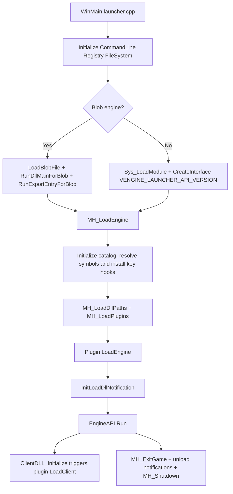

# MetaHook

## Overview
`MetaHook` is the core source collection on the Loader side. It starts the game engine (a normal PE or legacy blob), locates key internal engine symbols, installs hooks, loads and drives plugin lifecycles, forwards DLL load notifications, and reclaims resources during shutdown. The main execution chain enters through `src/launcher.cpp`, with its core logic implemented in `src/metahook.cpp`.

## Responsibilities
- Startup and restart control: parses the command line, initializes the registry/filesystem, selects and loads `hw.dll/sw.dll`, and executes `IEngineAPI::Run`.
- Engine adaptation and symbol location: resolves consumed private engine symbols from the gamedata catalog against the real engine base. Engine family/version comes from the module CRC64 and catalog gameVersion; no signature/string/disassembly fallback remains for these symbols. See [[metahook/privatevars/metahook-privatevars]].
- Hook infrastructure: provides four hook types—inline, VFT, IAT, and inline-patch—and supports transactional commits (batch registration followed by a single commit).
- Plugin lifecycle management: reads plugins from `plugins.lst`, negotiates V4/V3/V2/V1 interfaces, and calls `Init/LoadEngine/LoadClient/ExitGame/Shutdown`.
- Blob module loading: recognizes blob files, decodes, relocates, repairs imports, invokes entry points, and supports blob import-table hook queries.
- DLL load notifications: centrally distributes blob/Ldr load/unload events to plugins, carrying engine/client/blob/critical-region flags.
- Runtime capability exposure: exposes memory read/write, disassembly, pattern search, module queries, thread pools, notification registration, and other capabilities to plugins through `gMetaHookAPI` / `gMetaHookAPI_LegacyV2`.

## Involved Files (No Line Numbers)
- src/launcher.cpp
- src/metahook.cpp
- src/GameData.cpp
- src/GameData.h
- src/LoadBlob.cpp
- src/LoadBlob.h
- src/LoadDllNotification.cpp
- src/LoadDllNotification.h
- src/commandline.cpp
- src/registry.cpp
- src/sys_launcher.cpp
- src/Z.cpp
- src/sys.h
- include/metahook.h
- include/Interface/IPlugins.h

## Architecture
Main runtime flow:

Key source responsibilities:
- `launcher.cpp`: process entry point, single-instance mutex, engine DLL selection, engine-run loop, restart/video-mode fallback.
- `metahook.cpp`: core state and API tables, gamedata symbol resolution, hook management, plugin loading and lifecycle, image DLLs, thread pool. Pattern search and disassembly remain public capabilities, not private-engine-symbol fallback locators.
- `GameData.cpp`: immutable symbol catalog, module identities and CRC64 cache, versioned public symbol queries; see [[metahook/game-data]].
- `LoadBlob.cpp`: blob format validation/decoding/loading/unloading, blob queries, blob IAT hooks.
- `LoadDllNotification.cpp`: prioritizes `LdrRegisterDllNotification`, falls back to an `LdrLoadDll` detour, and centralizes event dispatch.
- `commandline.cpp`: command-line parsing and rewriting, supporting `@file` argument expansion.
- `registry.cpp`: read/write wrapper for `HKCU\Software\Valve\Half-Life\Settings`.
- `sys_launcher.cpp`: executable-path and long-path helper functions.
- `Z.cpp`: static buffer for the `.blob` section (enabled only in blob-support/debug builds).

## Dependencies
- Internal interfaces: `metahook.h`, `IPlugins.h`, `IEngineAPI.h`, `IFileSystem/IFileSystem_HL25`, `ICommandLine`, `IRegistry`.
- Third-party capabilities: Detours (inline detours), Capstone (disassembly/instruction scanning), MemoryModulePP/LoadDllMemoryApi (image-DLL loading and relocation), RapidJSON and Chocobo1Hash (catalog parsing and hashes), Musa.Veil (Windows internals), and VC-LTL (CRT compatibility).
- Runtime assets: `<game>/<mod>/metahook/configs/plugins.lst`, `<game>/<mod>/metahook/plugins/*.dll`, `<game>/<mod>/metahook/dlls` (recursively added to PATH), and `<game>/<mod>/metahook/gamedata/`. Plugins and their configuration are deployed separately.
- Plugin ABI: first negotiates `METAHOOK_PLUGIN_API_VERSION_V4`, then falls back to V3/V2/V1 in order.

## Notes
- Plugin invocation order is the reverse of the order written in `plugins.lst`: `MH_LoadPlugin` inserts at the head of a linked list, while `LoadEngine/LoadClient` traverse the list from its head.
- The `_SSE.dll` branch in `MH_LoadPlugins` performs duplicate attempts (the same condition twice).
- `MH_FreeHooksForModule` is currently `TODO`, although the unload-notification path already calls it; hook reclamation after module unloading is not actually implemented.
- `LoadDllNotification` dispatches callbacks even inside the `Ldr` critical region; plugin callbacks must avoid blocking or reentrancy-sensitive operations themselves.
- Blob code is enabled by `METAHOOK_BLOB_SUPPORT` or `_DEBUG`. The current CMake project provides ordinary Debug and Release only: Debug includes the blob branch, Release does not define the blob macro. There is no separate blob executable target.
- Missing required gamedata identities/symbols fail early via `MH_SysError`; add or correct upstream catalog data rather than restoring removed scanning fallbacks.
- `launcher.cpp` contains helper code that does not participate in the current main flow (for example, `SetActiveProcess` is not called).

## Callers (Optional)
- Startup caller: `WinMain` (`src/launcher.cpp`) directly calls `MH_LoadEngine` / `MH_ExitGame` / `MH_Shutdown`.
- Engine callback caller: the engine calls `ClientDLL_Initialize` while initializing the client; MetaHook takes control and triggers plugin `LoadClient`.
- Plugin caller: after obtaining `metahook_api_t` and `mh_interface_t` through `IPluginsV2+::Init`, plugins call back into Loader-exposed capabilities.

## Build and migration

The standalone target is defined in `CMakeLists.txt`; see [[metahook/suggested-commands]]. This note was migrated from MetaHookSv's `memory/MetaHook.md`, correcting its pre-gamedata symbol-location description and adapting paths to the standalone workspace. Source baseline and migration scope are recorded in [[metahook/project-overview]].
