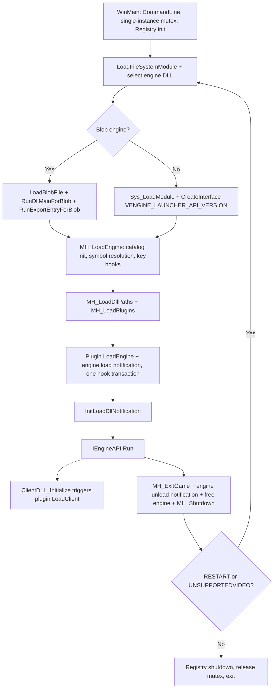

# MetaHook Project Overview

## Purpose and boundary

MetaHook is the standalone Windows x86 launcher and public API for GoldSrc/SvEngine client-side plugins. It starts the game engine (a normal PE or a legacy blob), resolves engine-private symbols from the gamedata catalog, installs hooks, drives plugin lifecycles, forwards DLL load notifications and reclaims resources on shutdown. It was extracted from MetaHookSv commit `11a852774b1725d02735aeb348c32a7bf454507c` (standalone CMake integration: `2f69a31`); the original notes remain in the [source knowledge tree](https://github.com/MetaHookSv/MetaHookSv/tree/11a852774b1725d02735aeb348c32a7bf454507c/memory).

- **Loader** (`src/`): engine startup, symbol resolution, hook infrastructure, plugin lifecycle and DLL notifications (see the sections below).
- **Public interfaces** (`include/metahook.h`, `include/Interface/`, HLSDK/SourceSDK/VGUI headers): paths and ABI kept stable for external consumers.
- **GameData** (`src/GameData.*`): immutable symbol catalog and module identities. See [[metahook/game-data]].
- Plugins (Renderer, BulletPhysics, VGUI2Extension, ...), PluginLibs and installer/tools are separate repositories with their own `memory/` notes. In the MetaHookSv aggregator this repository is the `MetaHook/` submodule; the aggregator points plugins at this repository's Chocobo1Hash and SDL header trees.

The source supports GoldSrc, GoldSrc HL25, SvEngine, CoF and legacy blob engines. Actual startup requires a matching catalog identity and data; these are implementation capabilities, not a game compatibility certification.

## Architecture conventions

- Trust upstream gamedata correctness; reuse existing parsing/query/release gates instead of adding a new defensive system for hypothetical incorrect RVAs, lengths or cross-snapshot metadata.
- Resolve catalog-backed addresses through `MH_LoadEngine_ResolveSymbol` / `MH_ResolveGameSymbol`; plugin consumers use `ResolveGameSymbol`. Do not restore signature/string/reverse-search fallbacks for those symbols. Pattern search and disassembly remain public plugin capabilities, not private-symbol locators.
- Resolve against the real module base. Module CRC64 plus the catalog `gameVersion` identify the binary and engine family; the game/mod name alone does not identify the loaded module.
- Missing required gamedata identities/symbols fail early through `MH_SysError`; fix the upstream catalog data rather than adding scanning fallbacks.
- Preserve public ABI and existing versioned `cbSize` behavior; the current API version is 115.

## Runtime flow

- `WinMain` initializes the command line and registry once, then loops per engine session. It selects `hw.dll`/`sw.dll` (or a blob), and on `ENGINE_RESULT_RESTART` / `ENGINE_RESULT_UNSUPPORTEDVIDEO` strips video-mode parameters and re-enters the loop.
- Plugin loading negotiates `METAHOOK_PLUGIN_API_VERSION_V4`, then V3/V2/V1. `Init` receives `metahook_api_t` (`gMetaHookAPI` for V3/V4, `gMetaHookAPI_LegacyV2` for V2), `mh_interface_t` and the save table. Lifecycle callbacks are `Init` / `LoadEngine` / `LoadClient` / `ExitGame` / `Shutdown`; see [[metahook/plugin-system]].
- `LoadClient` is triggered from MetaHook's `ClientDLL_Initialize`, which the engine calls while initializing the client; it passes the client export table.
- Hook types: inline, VFT, IAT and inline-patch, with transactional commits (batch registration, single commit). Other exposed capabilities: memory read/write, disassembly, pattern search, module queries, thread pools, DLL notification registration and game-symbol queries.
- DLL notifications prefer `LdrRegisterDllNotification` and fall back to an `LdrLoadDll` detour. Blob and Ldr load/unload events are dispatched centrally with engine/client/blob/critical-region flags.

## Source layout

- `src/launcher.cpp`: process entry, single-instance mutex, engine DLL selection, engine-run/restart loop and video-mode fallback.
- `src/metahook.cpp`: API tables, gamedata symbol resolution, hook management, plugin loading and lifecycle, mirror DLLs, thread pool. Consumed engine-private symbols: [[metahook/private-symbols]].
- `src/GameData.cpp`, `src/GameData.h`: symbol catalog, module identities and CRC64 cache, versioned public symbol queries.
- `src/LoadBlob.cpp`, `src/LoadBlob.h`: blob validation, decoding, loading/unloading, blob queries and blob IAT hooks.
- `src/LoadDllNotification.cpp`, `src/LoadDllNotification.h`: DLL load/unload notification registration and dispatch.
- `src/commandline.cpp`: command-line parsing and rewriting, including `@file` argument expansion.
- `src/registry.cpp`: wrapper for `HKCU\Software\Valve\Half-Life\Settings`.
- `src/sys_launcher.cpp`, `src/sys.h`: executable-path and long-path helpers.
- `src/Z.cpp`: `g_pBlobBuffer` placeholder that materializes the `.blob` section (blob target only).
- `include/metahook.h`, `include/Interface/IPlugins.h`: host/plugin contracts and plugin interface versions.
- `scripts/`: `build-MetaHook-x86.bat` with Debug/Release wrappers, `sync-gamedata.py`, `validate-gamedata.py` and `manifests/metahook.json`.
- `.github/`: LiveBuild and tag-release workflows sharing one composite build action.

Runtime assets live in the target game, not in this repository: `<game>/<mod>/metahook/configs/plugins.lst`, `<game>/<mod>/metahook/plugins/*.dll`, `<game>/<mod>/metahook/dlls/` (the directory and all subdirectories are appended to `PATH`) and `<game>/<mod>/metahook/gamedata/`. Plugins and their configuration are deployed separately.

## Build and dependencies

- Windows x86, Visual Studio 2022 v143, C++20, CMake 3.21+, Python 3.8+ for gamedata synchronization/validation. Debug and Release use `/MTd` and `/MT` with VC-LTL 5.3.1, which `cmake/Dependencies.cmake` downloads and verifies; it also initializes missing submodules.
- Pinned source submodules: Detours, Capstone, RapidJSON, Chocobo1Hash, Musa.Veil, MemoryModulePP (`LoadDllMemoryApi`), SDL3 and sdl2-compat. The launcher does not link SDL, Renderer, OpenGL or physics.
- Both configurations build two executables from the same sources: `MetaHook.exe` without blob support and `MetaHook_blob.exe` with `METAHOOK_BLOB_SUPPORT` plus `/INCLUDE:_g_pBlobBuffer`, which keeps the otherwise unreferenced `.blob` section that the loader fills at runtime. Blob code is gated only by `METAHOOK_BLOB_SUPPORT`, independent of `_DEBUG`; a blob engine or blob client under `MetaHook.exe` fails early, asking for `metahook_blob.exe`.
- `MetaHook_blob.exe` uses `/SAFESEH:NO` in both configurations: runtime-loaded blob exception handlers cannot appear in the launcher's link-time SafeSEH table. Keeping that table in Release causes Windows to reject engine exception handlers during map loading. The ordinary Release `MetaHook.exe` retains SafeSEH.
- `METAHOOK_BUILD_SDL` (default ON) builds SDL3 and sdl2-compat through `cmake/SDL.cmake` only to install `SDL3.dll` and `SDL2.dll` beside the launcher; no SDL SDK (headers, import libraries, package configs, licenses) is installed. SDL header consumers read `thirdparty/{SDL3_fork,sdl2-compat-fork}/include` directly.
- `METAHOOK_SYNC_GAMEDATA` (default ON) synchronizes and validates the launcher's pruned gamedata during the build.
- `build/x86/<configuration>/`: generated projects, objects and staged gamedata. `install/x86/<configuration>/`: `MetaHook.exe`, `MetaHook_blob.exe`, their PDBs, `SDL2.dll`, `SDL3.dll` and `svencoop/metahook/gamedata/`. Both are ignored.
- Commands: [[metahook/suggested-commands]]. Build internals, dependency pinning and verification records: [[metahook/build-and-verification]]. User-facing documentation: root `README.md` and `docs/`.

## Known limitations and pitfalls

- Plugin invocation order is the reverse of `plugins.lst`: `MH_LoadPlugin` inserts at the head of a linked list, and `LoadEngine` / `LoadClient` traverse from the head.
- The `_SSE.dll` branch in `MH_LoadPlugins` tries the same candidate twice.
- `MH_FreeHooksForModule` is an empty stub although the unload-notification path calls it; hooks are not reclaimed when a module unloads.
- `LoadDllNotification` dispatches callbacks inside the Ldr critical region; plugin callbacks must avoid blocking and reentrancy-sensitive work.
- `launcher.cpp` keeps helper code outside the main flow (for example, `SetActiveProcess` is never called).

## Related notes

| Note | Content |
| --- | --- |
| [[metahook/game-data]] | Catalog architecture, parser/query contracts, API evolution and validation |
| [[metahook/private-symbols]] | Engine-private symbol inventory, cvar branches and engine classification |
| [[metahook/plugin-system]] | Host-facing plugin interfaces, loading and lifecycle |
| [[metahook/code-styles]] | Source conventions |
| [[metahook/suggested-commands]] | CMake build/install and gamedata commands |
| [[metahook/build-and-verification]] | Build internals, dependency pinning and verification records |
| [[metahook/task-completion]] | Scope-appropriate verification and delivery checks |

Notes use `metahook/` permalinks. The `basic-memory` MCP server configured for this checkout is pinned to the `metahooksv` project, which does not resolve to this `memory/` directory; read and edit these markdown files directly until a project bound to this checkout is configured.
